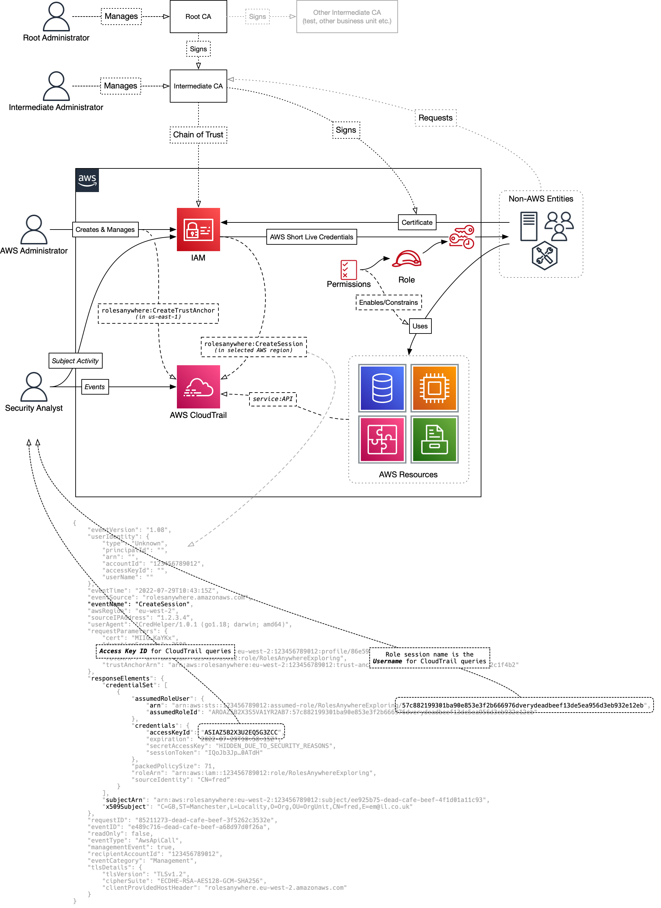

### Intro
A very quick and dirty exploration of the new AWS IAM Roles Anywhere feature...

Cobbled this together from a few sources:
* https://openssl-ca.readthedocs.io/en/latest/introduction.html
* https://www.openssl.org/docs/manmaster/man5/x509v3_config.html
* `man openssl`
* https://docs.aws.amazon.com/rolesanywhere/latest/userguide/credential-helper.html

### Usage
The [create.sh](./create.sh) script endeavours to create the root & intermediate certificate authorities, then create and sign (with the intermediate) a user cert... With those artefacts, it relies on you having appropraite AWS permissions to create the Trust Anchor, a Role (using the AWS read only policy) and a Profile.

The [set-creds.sh](./set-creds.sh) script must be run as `. ./set-creds.sh` in order to set the AWS environment variables. Otherwise, they'll set themselves inside the script, then be lost when the script ends. If it works, then you'll have the permission scope of the role that is linked to the profile, authenticated via the certs. Magic.

### Some maybe useful links
* https://docs.aws.amazon.com/rolesanywhere/latest/userguide/trust-model.html
* https://docs.aws.amazon.com/rolesanywhere/latest/userguide/monitoring-subjects.html
* https://docs.aws.amazon.com/awscloudtrail/latest/userguide/view-cloudtrail-events.html
* https://docs.aws.amazon.com/IAM/latest/UserGuide/cloudtrail-integration.html#cloudtrail-integration_signin-tempcreds
* https://docs.aws.amazon.com/IAM/latest/UserGuide/reference_identifiers.html

### Refunds
Absolutely no warranty provided, this worked fine on my Mac this evening (macOS 12.5, homebrew up-to-date etc.) so any issues, please scratch your noggin and figure it out 🖖

### Refinement
You'll absolutely want to delve into the finer detail, such as using the `aws:PrincipalTag/x509Subject/[CN|OU|O]` condition! 

Having said that, hope this is useful to someone out there...

### Pretty Pictures...
Oh, and the missing diagram, every repo needs a diagram:

